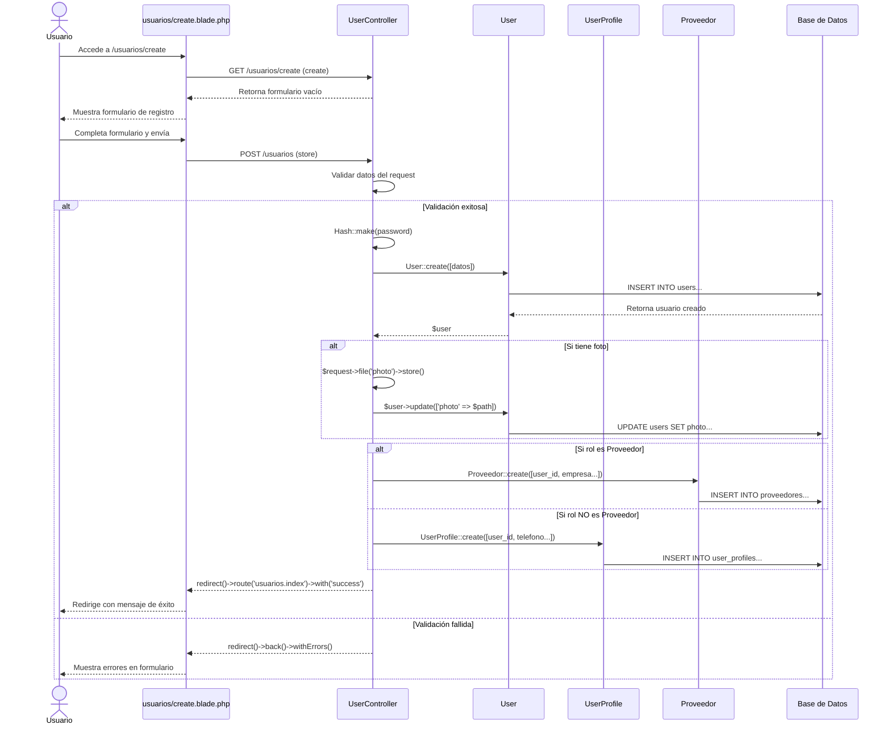

# Diagrama de Secuencia: Crear Usuario

## Descripción
Muestra el proceso completo de creación de un usuario, incluyendo validación, hash de contraseña, subida de foto, y creación condicional de perfil de proveedor o usuario regular.
