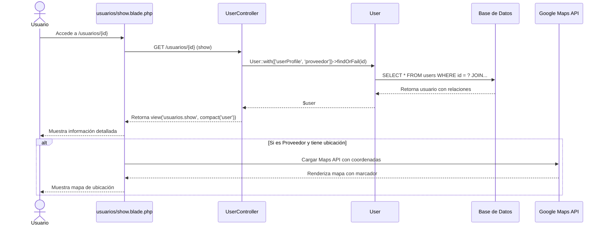

# Diagrama de Secuencia: Ver Detalles de Usuario

## Descripción
Diagrama que representa la visualización de detalles de un usuario específico, incluyendo la carga de su perfil completo y, si es proveedor, su ubicación en Google Maps.
