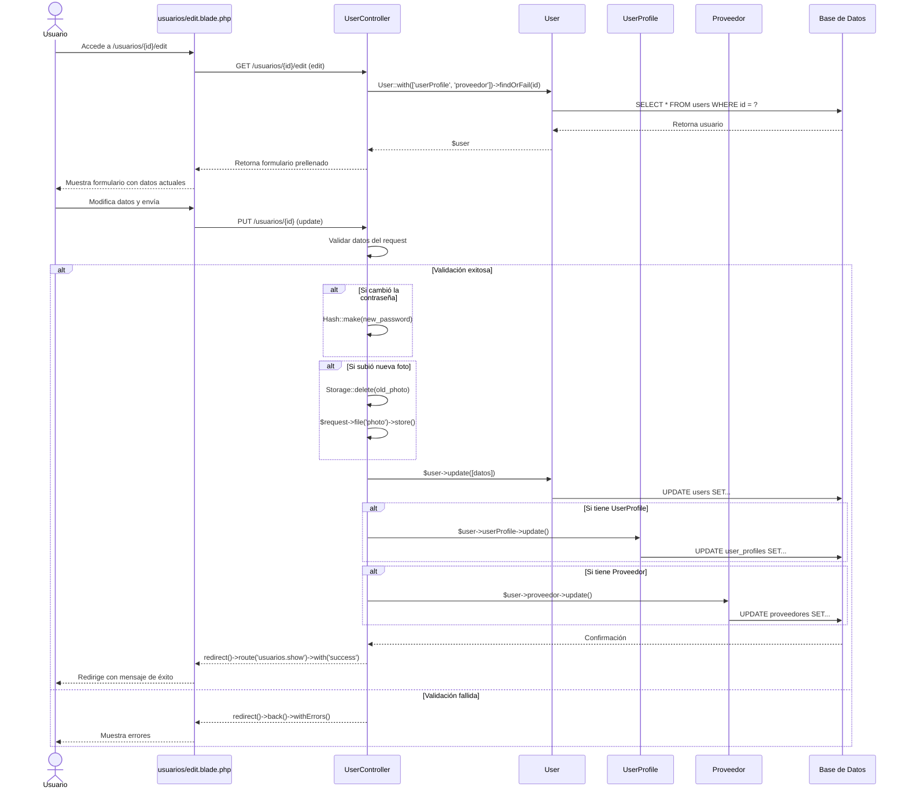

# Diagrama de Secuencia: Editar Usuario

## Descripción
Proceso de actualización de un usuario existente, incluyendo la gestión de contraseñas, fotos, y actualización en cascada de perfiles relacionados (UserProfile o Proveedor).
