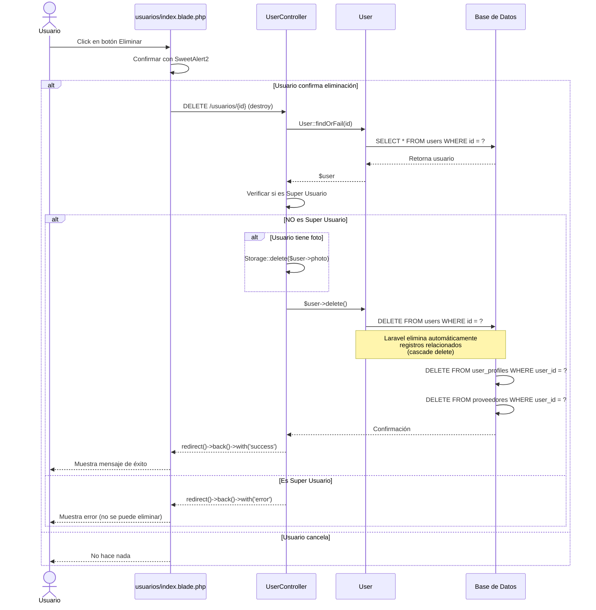

# Diagrama de Secuencia: Eliminar Usuario

## Descripción
Flujo de eliminación de un usuario con validación de permisos (protección del Super Usuario), eliminación en cascada de relaciones, y limpieza de archivos asociados.
